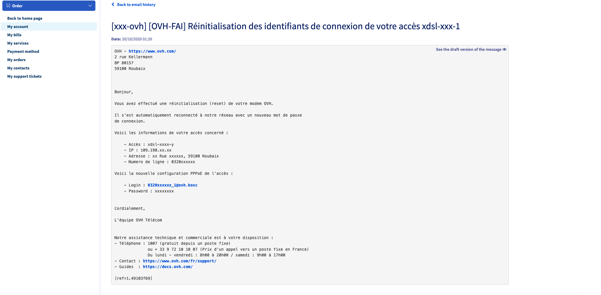

**Dernière mise à jour le 01/06/2021**

## Objectif

Si vous souhaitez utiliser votre équipement personnel pour gérer la connexion PPPoE sur votre offre xDSL/FTTH OVHcloud, vous devez récupérer les identifiants PPPoE associés cet accès.

Les identifiants *Point to Point Protocol over Ethernet* (PPPoE) sont composés d'un nom d'utilisateur (ID) sous la forme xxxxxxxxxx@ovh.xxx et d'un mot de passe unique. Leur fonction est d'authentifier un équipement (équipement personnel ou modem fourni par OVHcloud) sur les infrastructures OVHcloud.

**Découvrez comment utiliser les API OVHcloud pour récupérer les identifiants PPPoE d'un accès à Internet**.

## Prérequis

- Disposer d'une [offre xDSL ou FTTH OVHcloud](https://www.ovhtelecom.fr/offre-internet/) active.
- Disposer d'un équipement (routeur, firewall) compatible PPPoE.
- Être connecté à l'[espace client OVHcloud](https://www.ovh.com/auth?onsuccess=https%3A%2F%2Fwww.ovhtelecom.fr%2Fmanager&ovhSubsidiary=fr).
- Être connecté aux [API OVHcloud](https://api.ovh.com/){.external}.
- Consulter le guide [Premiers pas avec les API OVHcloud](../../api/api-premiers-pas/) pour vous familiariser avec l'utilisation des APIv6 OVHcloud.

## En pratique

Les identifiants PPPoE vous sont envoyés par e-mail (à l'adresse e-mail de contact de votre compte OVHcloud) pendant la livraison de votre accès. 
Ces identifiants vous permettent de configurer le modem OVHcloud, dans le cas d’une configuration manuelle en local, ou un équipement personnel pour l’usage de votre accès à Internet.

Si votre offre a été fournie avec un modem OVHcloud, les identifiants PPPoE vous sont envoyés par e-mail systématiquement après chaque réinitialisation du modem.

Le *login* reste identique après chaque réinitialisation.
Pour des raisons de sécurité, le *mot de passe* est systématiquement modifié après chaque réinitialisation.

Si vous souhaitez utiliser votre propre modem/routeur, vous pouvez utiliser les API OVHcloud afin de générer l'envoi de nouveaux identifiants PPPoE par e-mail. 

Dans un premier temps, il vous faut retrouver le *serviceName* de votre accès à Internet.

### Récupérer le serviceName de votre accès xDSL ou FTTH

Le *serviceName* correspond à la référence interne de votre accès. Pour la retrouver, connectez-vous à votre [espace client OVHcloud](https://www.ovh.com/auth?onsuccess=https%3A%2F%2Fwww.ovhtelecom.fr%2Fmanager&ovhSubsidiary=fr), partie `Telecom`{.action}. Cliquez sur `Accès Internet`{.action} dans le menu de gauche puis sélectionnez votre offre xDSL ou FTTH. La référence interne est affichée dans le cadre `Accès Internet` à droite.

{.thumbnail}

### Générer l'envoi de nouveaux identifiants par e-mail

> [!warning]
>
> Chaque utilisation de l'appel API décrit ci-dessous générera un nouveau mot de passe PPPoE. **Cela aura pour effet de couper la session de votre modem si elle est active, occasionnant une déconnexion**. N'utilisez donc cet appel API que si vous êtes certain de pouvoir reconfigurer votre équipement personnel dans la foulée.
>

Utilisez l'appel API :

> [!api]
>
> @api {POST} /xdsl/{serviceName}/requestPPPLoginMail
>

Saisissez, dans le champ `serviceName`, la référence de votre accès obtenue à l'étape précédente. Cliquez alors sur `Execute`{.action}. Le message `null` confirmera la bonne prise en compte de votre demande.

Dans un délai approximatif de deux à trois minutes, vous recevrez un e-mail, **sur l'adresse e-mail de contact du compte OVHcloud**, contenant l'identifiant PPPoE et le nouveau mot de passe.

#### Retrouver l'email dans l'espace client OVHcloud

Si vous n'avez pas accès à l'adresse e-mail de contact du compte OVHcloud, vous pouvez consulter les e-mails de service depuis l'[espace client OVHcloud](https://www.ovh.com/auth?onsuccess=https%3A%2F%2Fwww.ovhtelecom.fr%2Fmanager&ovhSubsidiary=fr).

Une fois connecté, cliquez sur `E-mails de service`{.action} sous votre identifiant.

{.thumbnail}

L'objet de l'e-mail est le suivant :

{.thumbnail}

Voici un exemple d'e-mail contenant les identifiants PPPoE :

{.thumbnail}

## Aller plus loin

Échangez avec notre communauté d'utilisateurs sur [https://community.ovh.com](https://community.ovh.com).
