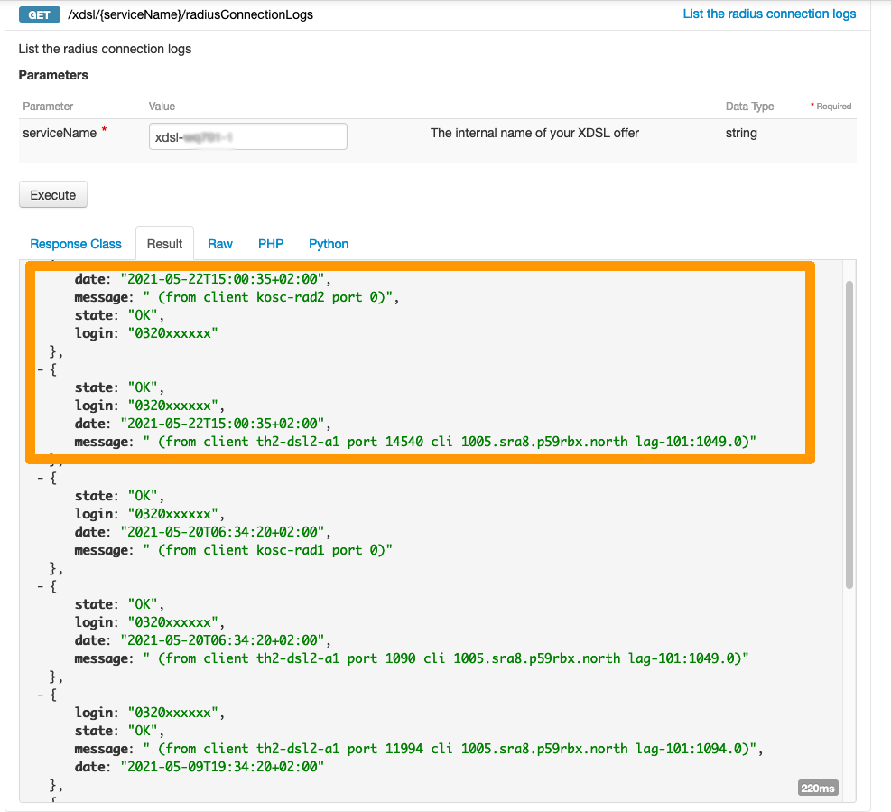

**Dernière mise à jour le 28/05/2021**

## Objectif

Les *logs radius* disponibles via les API OVHcloud permettent de vérifier la stabilité d'un accès à Internet.

**Découvez comment vérifier la stabilité d'un lien xDSL ou FTTH en utilisant les logs fournis par les API OVHcloud**

## Prérequis

- Disposer d'une [offre xDSL ou FTTH OVHcloud](https://www.ovhtelecom.fr/offre-internet/) active.
- Être connecté à l'[espace client OVHcloud](https://www.ovh.com/auth?onsuccess=https%3A%2F%2Fwww.ovhtelecom.fr%2Fmanager&ovhSubsidiary=fr).
- Être connecté aux [API OVHcloud](https://api.ovh.com/){.external}.
- Consulter le guide [Premiers pas avec les API OVHcloud](../../api/api-premiers-pas/) pour vous familiariser avec l'utilisation des APIv6 OVHcloud.

## En pratique

### Détails des logs radius

Lors de chaque connexion de votre routeur sur les équipements OVHcloud, une trace est systématiquement laissée à notre niveau sur les logs de l’équipement nommé **radius**. 

Lors de chaque reconnexion du lien, une nouvelle trace horodatée de la connexion est créée. 
Une reconnexion peut avoir l'une des causes suivantes :

* un redémarrage de votre modem,
* une perte de sychronisation,
* un incident générique,
* l'envoi manuel de [nouveaux identifiants de connexion](../obtenir-identifiants-ppoe).

> [!primary]
>
> Seules les **reconnexions** font l'objet de *logs radius*.  
> Une absence de traces est donc possible sur un accès n'ayant pas connu de coupure récente ou sur un accès actuellement déconnecté.
>

La période de récupération des logs radius est de trois mois maximum.

### Récupérer le serviceName de votre accès xDSL ou FTTH

Le *serviceName* correspond à la référence interne de votre accès. Pour la retrouver, connectez-vous à votre [espace client OVHcloud](https://www.ovh.com/auth?onsuccess=https%3A%2F%2Fwww.ovhtelecom.fr%2Fmanager&ovhSubsidiary=fr), partie `Telecom`{.action}. Cliquez sur `Accès Internet`{.action} dans le menu de gauche puis sélectionnez votre offre xDSL ou FTTH. La référence interne est affichée dans le cadre `Accès Internet` à droite.

{.thumbnail}

### Utiliser les API OVHcloud

Utilisez l'appel API suivant pour récupérer les logs :

> [!api]
>
> @api {GET} /xdsl/{serviceName}/radiusConnectionLogs
>

Saisissez, dans le champ `serviceName`, la référence de votre accès obtenue à l'étape précédente. Cliquez alors sur `Execute`{.action} 

Voici un exemple de retour :

{.thumbnail}

Vous retrouvez, dans l'encadré orange ci-dessus, les informations d'un log de reconnexion. La première partie détaille les informations suivantes :

- date: la date au format AAAA-MM-JJTHH:mm:ss+GMT,
- message : lié à l'opérateur de collecte,
- state : l'état de connexion, ici fonctionnel car `OK`. À noter qu'un refus d'authenfication donnera `KO` ainsi que, le plus souvent, un message `wrong login or password`.
- login : l'identifiant PPPoE de votre accès.

La seconde partie, telle qu'affichée dans l'encadré orange, est l'effet miroir sur les équipements OVHCloud qui finalisent l'authentification. 

Une reconnexion génère donc deux logs. Sont stockés 50 logs au maximum, donc un total de 25 reconnexions.

### Vérifier la stabilité de votre accès

Grâce aux logs de l'exemple ci-dessus, nous pouvons déduire que si cet accès répond toujours à une requête de *ping* le 28/05/2021 et que la dernière reconnexion sur les équipements OVHCloud est datée du 22/05/2021, alors la session PPPoE est montée depuis 6 jours environ.

Il n'y donc pas eu de coupure sur l'accès concerné pendant cet intervalle. En effet, la moindre reconnexion suite, par exemple, à un redémarrage du modem, aurait généré des logs radius de reconnexion sur nos équipements. 

Si un accès remonte plus de cinq reconnexions sur une même tranche de 24h, sans que celles-ci ne soient consécutives à des actions intentionnelles sur le modem (rédémarrage ou réinitialisation), il est alors légitime de considérer cet accès comme instable. 

Si vous constatez des reconnexions fréquentes sur l'un de vos accès xDSL ou FTTH, nous vous conseillons de faire le point sur votre [desserte interne](../la-desserte-interne/) et de consulter nos guides de [diagnostic et dépannage](../).

> [!primary]
>
> Si un accès n'est plus synchronisé, il ne pourra évidemment plus s'authentifier sur les équipements OVHcloud.
> 

## Aller plus loin

Échangez avec notre communauté d'utilisateurs sur [https://community.ovh.com](https://community.ovh.com).
