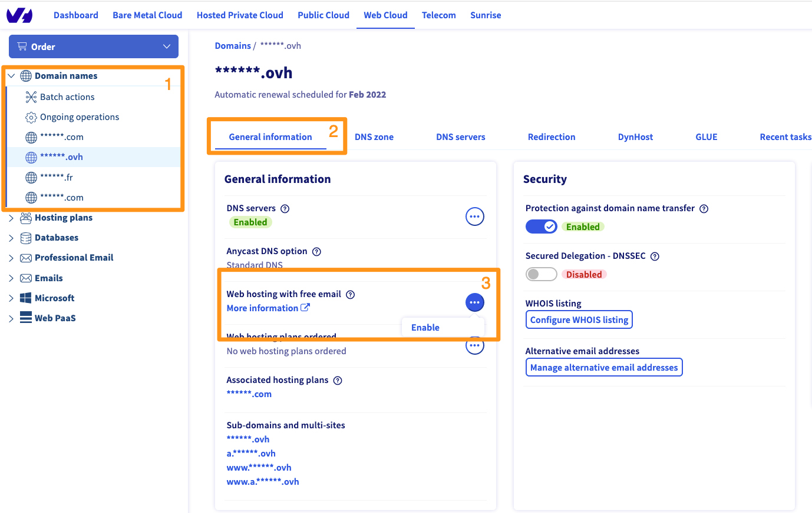

> [!primary]
> Diese Übersetzung wurde durch unseren Partner SYSTRAN automatisch erstellt. In manchen Fällen können ungenaue Formulierungen verwendet worden sein, z.B. bei der Beschriftung von Schaltflächen oder technischen Details. Bitte ziehen Sie beim geringsten Zweifel die englische oder französische Fassung der Anleitung zu Rate. Möchten Sie mithelfen, diese Übersetzung zu verbessern? Dann nutzen Sie dazu bitte den Button «Mitmachen» auf dieser Seite.
>

**Letzte Aktualisierung am 15.06.2021**

## Ziel

Mit dem [Start 10M](https://www.ovh.de/domains/angebot_hosting_start10m.xml){.external} bietet Ihnen OVHcloud ein Webhosting mit 10 MB und einen E-Mail-Account mit 5 GB Speicherplatz. In dieser Anleitung erfahren Sie, wie Sie das Start 10M Hosting für einen [Domainnamen](https://www.ovh.de/domains/){.external} aktivieren.

> [!warning]
> Dieses kostenlose Hosting mit 10 MB ist für eine einfache Präsentationsseite **ohne Datenbanknutzung** geeignet. Wenn Sie eine Website mit mehreren Seiten einrichten möchten, die eine Datenbank benötigt, wie etwa ein CMS (Worpdress, Joomla, PrestaShop, Drupal, etc.), bestellen Sie bitte eines unserer [Webhosting-Angebote direkt auf der Website](https://www.ovh.de/hosting/) oder im [OVHcloud Kundencenter](https://www.ovh.com/auth/?action=gotomanager&from=https://www.ovh.de/&ovhSubsidiary=de).
>

**Diese Anleitung erklärt, wie Sie Ihr kostenloses Start 10M Hosting im OVHcloud Kundencenter aktivieren.**

## Voraussetzungen

- Sie haben Zugriff auf Ihr [OVHcloud Kundencenter](https://www.ovh.com/auth/?action=gotomanager&from=https://www.ovh.de/&ovhSubsidiary=de).
- Sie verfügen über einen [Domainnamen](https://www.ovh.de/domains/){.external} in Ihrem Kunden-Account, der noch keinem Hosting zugeordnet ist.

## In der praktischen Anwendung

Loggen Sie sich in Ihr [OVHcloud Kundencenter](https://www.ovh.com/auth/?action=gotomanager&from=https://www.ovh.de/&ovhSubsidiary=de) ein und klicken Sie im Bereich `Web Cloud`{.action} links in der Menüleiste auf`Domainnamen`{.action} (**1**) und wählen Sie die betreffende Domain aus.

Im Bereich **Allgemeine Informationen** (**2**) finden Sie den Abschnitt *Gratis Webhosting und E-Mail*. Klicken Sie rechts auf den Button `...`{.action} und anschließend auf `Aktivieren`{.action} (**3**).

{.thumbnail}

Daraufhin öffnet sich das Aktivierungsfenster. **Schritt 1** zeigt Ihnen Angebotsinformationen an. Klicken Sie auf `Weiter`{.action} und wählen Sie in **Schritt 2** die Änderungen aus, die Sie in Ihrer DNS-Zone vornehmen möchten:

{.thumbnail}

| Option                                       	| Beschreibung                                                                                                               								|
|--------------------------------------------	|-----------------------------------------------------------------------------------------------------------------------------------------------------------|
| DNS A Eintrag                         	| Die Domain wird auf die IP-Adresse des Start 10M Hostings verweisen.                                               								|
| DNS MX Eintrag 	| Die E-Mail-Server von OVHcloud werden für die Domain eingetragen. 	|

> [!primary]
> Zur Erinnerung: Beim kostenlosen Start 10M Hosting sind keine Datenbanken inklusive. Wenn Ihr Projekt eine solche benötigt, wählen Sie stattdessen ein passendes [Webhosting](https://www.ovh.de/hosting/), das immer mindestens eine Datenbank enthält.

**Schritt 3** erinnert Sie an die Preisgestaltung des Angebots. In **Schritt 4** müssen Sie die Verträge annehmen und Ihre Bestellung bestätigen.

Sobald Ihre Bestellung bestätigt wurde, erhalten Sie eine E-Mail mit den [FTP-Login-Daten](../verbindung-ftp-speicher-webhosting/) zu Ihrem Start 10M Hosting.

Um die im Start 10M Hosting enthaltene E-Mail-Adresse zu verwenden, lesen Sie die Anleitung "[Eine E-Mail-Adresse mit MX Plan erstellen](../../emails/e-mail-adresse-erstellen/)".

## Weiterführende Informationen

[Mit dem Speicherplatz Ihres Webhostings verbinden](../verbindung-ftp-speicher-webhosting/)

[Eine E-Mail-Adresse mit MX Plan erstellen](../../emails/e-mail-adresse-erstellen/)

Für den Austausch mit unserer User Community gehen Sie auf <https://community.ovh.com/en/>.
