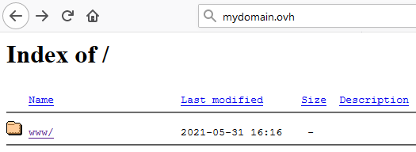
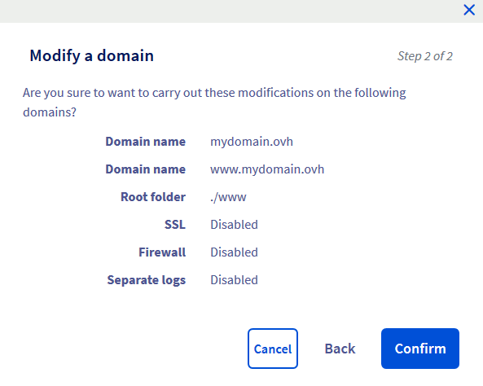

**Last updated 28/06/2021**

## Objective

If a `Multisite` configuration is not correctly configured, your website may display an **« Index of »** page.

{.thumbnail}

**Find out how to change the display of an « Index of » page.**

> [!warning]
>
> OVHcloud provides services which you are responsible for with regard to their configuration and management. You are therefore responsible for ensuring they function correctly.
>
> We have provided you with this guide in order to help you with common tasks. Nevertheless, we recommend contacting a specialist provider and/or the service’s software publisher if you encounter any difficulties. We will not be able to assist you ourselves. You can find more information in the [Go further](#gofurther) section of this guide.
>

## Requirements

- a [web hosting plan](https://www.ovh.ie/web-hosting/)
- access to the [OVHcloud Control Panel](https://www.ovh.com/auth/?action=gotomanager&from=https://www.ovh.ie/&ovhSubsidiary=ie)

## Instructions

### Understanding the origin of the « Index of » page

Your domain name is connected, through the `Multisite` section of your hosting, to a directory (a « `Root folder` ») on your [FTP](../log-in-to-storage-ftp-web-hosting/) server.

The **« Index of »** page indicates that the directory does not contain any **index.php** or **index.html** file. Such a file is meant to be the « entry point » of your website.

To display your website, from the `Multisite` section of your hosting plan, you will need to link your domain to the `Root folder` that contains this **index.php** or **index.html** file.

> [!primary]
>
> If you want to temporarily link your domain to a `Root folder` that does not contain an **index.php** or **index.html** file, you can prevent the list of folders from being displayed on your web site by following this [guide](../what_else_can_you_do_with_the_htaccess_file/#prevent-the-content-of-a-directory-from-being-listed). You can also protect the access to your folders with a [password](../how_to_password_protect_a_directory_on_your_website/).
>
> We recommend contacting a [specialised provider](https://partner.ovhcloud.com/en-ie/directory/) if you experience any difficulties setting up this configuration. Our support teams will not be able to assist you with any changes to your website’s internal programming.

### Resolve the most common case of an « Index of » page

You have imported the files from your **mydomain.ovh** website into the `www` folder on your web hosting plan through an [FTP](../log-in-to-storage-ftp-web-hosting/) connection. But your domain name is not linked to this folder in the `Root folder` column of your `Multisite`.

{.thumbnail}

Modify the `Root folder` by clicking on the `...`{.action} button to the right of the table, then on `Modify domain`{.action}:

{.thumbnail}

Select the `Also modify the www.mydomain.ovh subdomain` checkbox and type the name of the folder containing your web site's **index.php** or **index.html** file in the `Root folder` section.

> [!primary]
>
> There is no oligation to use the `www` directory as `Root Folder`. You can install your website in any other folder within your [FTP server](../log-in-to-storage-ftp-web-hosting/).

Then click on `Next`.

{.thumbnail}

Then on the `Confirm`{.action} button.

{.thumbnail}

You will get the following result:

{.thumbnail}

## Go further 

[Resolve the most common 1-click module errors](../error-frequently-1-click-modules/)

[Resolve the “Website not installed” error](../web_hosting_error_-_website_not_installed/)

[Hosting multiple websites on your Web Hosting plan](../multisites-configuring-multiple-websites/)

If you would like assistance using and configuring your OVHcloud solutions, please refer to our support [offers](https://www.ovhcloud.com/en-ie/support-levels/).

Join our community of users on <https://community.ovh.com/en/>.
